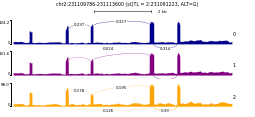

# This repository was forked from the original pyGenomeTracks with some modifications to plot Sashimi plots.

## For installation, documentation and reference of pyGenomeTracks, please refer to the original pyGenomeTracks repo.

[](https://pypi.org/project/pyGenomeTracks/) [](https://anaconda.org/bioconda/pygenometracks)
[](http://bioconda.github.io)
[](https://travis-ci.org/deeptools/pyGenomeTracks)


pyGenomeTracks
==============

## Citation
Please refer to the original pyGenomeTracks paper:

Fidel Ramírez, Vivek Bhardwaj, Laura Arrigoni, Kin Chung Lam, Björn A. Grüning, José Villaveces, Bianca Habermann, Asifa Akhtar & Thomas Manke. High-resolution TADs reveal DNA sequences underlying genome organization in flies. Nature Communications (2018) [doi:10.1038/s41467-017-02525-w](https://www.nature.com/articles/s41467-017-02525-w)

## Usage
This fork contains a custom PyGenomeTracks class, SashimiBigwig, to generate Sashimi plots. Please note that other tools exist to generate Sashimi plots. The strength of this tools is to easily generate Sashimi plots based on the PyGenomeTracks infrastructure. This also means that you can plot Sashimi plots together with other tracks available in PyGenomeTracks (e.g. bed, bigwig and gtf). Unlike MISO, this tool does not rely on an annotation file to plot the Sashimi plot, which is ideal if you are using tools like LeafCutter.

To use this tool:

### Install PyGenomeTracks
Installation guides can be found in the original [PyGenomeTracks repository](https://github.com/deeptools/pyGenomeTracks) or [documentation](https://pygenometracks.readthedocs.io/en/latest/index.html).

### Clone this repo to your local computer.
```sh
$ git clone https://github.com/Zepeng-Mu/pyGenomeTracks.git
```

### Figure out where your PyGenomeTracks package is installed.
Python packages are installed in a specific folder, depending whether you used `pip` or `conda` to install the package. For example, on the high-performance computing system I'm using, the package is installed here: `~/.local/lib/python3.7/site-packages/pygenometracks/`. The structure of this folder looks like:
```sh
.
├── getAllDefaultsAndPossible.py
├── __init__.py
├── makeTracksFile.py
├── plotTracks.py
├── __pycache__
│   ├── getAllDefaultsAndPossible.cpython-37.pyc
│   ├── __init__.cpython-37.pyc
│   ├── makeTracksFile.cpython-37.pyc
│   ├── plotTracks.cpython-37.pyc
│   ├── readBed.cpython-37.pyc
│   ├── readGtf.cpython-37.pyc
│   ├── tracksClass.cpython-37.pyc
│   ├── utilities.cpython-37.pyc
│   └── _version.cpython-37.pyc
├── readBed.py
├── readGtf.py
├── tracks
│   ├── BedGraphMatrixTrack.py
│   ├── BedGraphTrack.py
│   ├── BedTrack.py
│   ├── BigWigTrack.py
│   ├── EpilogosTrack.py
│   ├── GenomeTrack.py
│   ├── GtfTrack.py
│   ├── HiCMatrixTrack.py
│   ├── HLinesTrack.py
│   ├── __init__.py
│   ├── LinksTrack.py
│   ├── NarrowPeakTrack.py
│   ├── __pycache__
│   ├── ScaleBarTrack.py
│   └── TADsTrack.py
├── tracksClass.py
├── utilities.py
└── _version.py

3 directories, 35 files
```

The `tracks` directory is the key folder here. This is where all the track classes in PyGenomeTracks files are located. Track classes can only be recognized in the `.ini` file if the corresponding track class is located in this folder. This is also the place where we can put customized track classes. For more details see [here](https://pygenometracks.readthedocs.io/en/latest/content/adding-new-tracks.html).

### Copy SashimiBigwig track class to `tracks` folder
Suppose you are in the folder for this cloned repo (NOT the installed PyGenomeTracks package):
```sh
cp pygenometracks/tracks/SashimiBigwig.py <PyGenomeTracks installation path>/tracks/
```
### Prepare input files
In order to generate Sashimi plot, two types of files are needed.
1. Bigwig files for RNA-seq coverage. These are just bigwig files that you would normally for the bigwig track class.
2. Link files for junctions to plot and labels. This looks like the file for the original links track class, with an **additional** column at the end: the number on the label (could be the number of split reads supporting the junction or PSI calculated from a certain tool.) An example file looks like this:
```
chr2    231109786       231109786       chr2    231110578       231110578       0.0372936854616429
chr2    231109786       231109786       chr2    231112631       231112631       0.0597340361211572
chr2    231109795       231109795       chr2    231110578       231110578       0.178226805210714
chr2    231109795       231109795       chr2    231112631       231112631       0.126256827523686
chr2    231110655       231110655       chr2    231111964       231111964       0.0149937309749814
chr2    231110655       231110655       chr2    231112631       231112631       0.195029646753571
chr2    231110655       231110655       chr2    231113600       231113600       0.0239748059030143
chr2    231112780       231112780       chr2    231113600       231113600       0.390030949667857
```

The column names are: chr_intron_start, pos_start, pos_start, chr_intron_end, pos_end, pos_end, psi (this is just for you to understand the file, column names should not be included in the link file).

### Make a `.ini` file:
An example section in the `.ini` file:
```
title = 
# Path to bigwig file
bw_file = 
# Path to links file
link_file = 
height = 0.8
bw_color = 
number_of_bins = 
max_value = 
nans_to_zeros = true
summary_method = mean
show_data_range = true
link_color = 
line_style = 
fontsize = 2
# The link in Sashimi plot is a Bezier curve.
# The height of the curve is calculated from the length of the intron.
# When the y-axis in bigwig track is different, the height of curve needs to be scaled.
scale_link_height = 1
# The line width for links is proportion to the numbers at the last column in links file (PSI).
# But the absolute width is calculated from the supplied numbers, which can look too thin or too wide sometimes.
# Use scale_line_width to scale the absolute line widths.
# You may need to try several values to get a satisfying result.
scale_line_width = 3
file_type = sashimiBigWig
```

### Run `pygenometracks` as you normally do to generate the figure
If you want to try the example provided, go to the cloned repo, then:
```sh
cd example_sashimi
pyGenomeTracks --tracks chr2-231091223_231109786_231113600.ini --region chr2:231107879-231115507 -t 'chr2:231109786-231113600 (sQTL = 2:231091223, ALT=G)' --width 9 --trackLabelFraction 0.01 -out example.pdf --fontSize 4
```

The resulting plot `example.png` looks like this:



This example shows a splicing QTL (sQTL) for gene *SP140*. The three tracks 0, 1, and 2 represents average RNA-seq coverage for individuals with 0, 1, and alternative allele (G) for SNP chr2:231091223. To generate similar plots on your data, you will need a custom script that calculate average coverage from a group of samples with the same genotype at a given position. Of course, you can also group samples by any other criteria that fits your needs, for instance combining by treatment and control.

## Showcase
This tool has been used to generate Sashimi plots in published articles:
